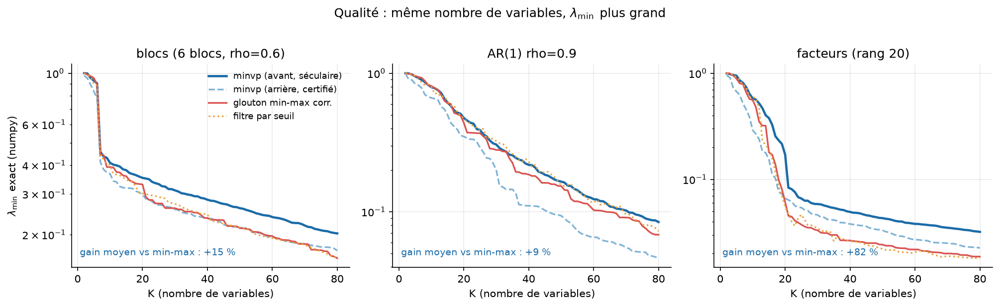

# minvp — sélection E-optimale de variables, en Rust

**`minvp` choisit, pour chaque taille K, le sous-ensemble de K variables dont la matrice
de corrélation est la mieux conditionnée** — c'est-à-dire celui qui maximise sa plus
petite valeur propre `λ_min(R_S)` (critère *E-optimal*, équivalent à `σ_min(Z_S)²`).

Problème NP-difficile → familles **imbriquées** construites par glouton, mais un glouton
qui se paie le luxe d'être **exact et certifié** :

| | |
|---|---|
| 🎯 **Qualité** | critère séculaire (et non une simple corrélation), jusqu'à **+82 %** de `λ_min` à K fixe vs le filtre de corrélation naïf |
| ✅ **Certificat** | **les deux sens** de parcours sont certifiés : élimination arrière *et* sélection avant s'arrêtent sur une borne supérieure valide par candidat |
| ⚡ **Vitesse** | **10 000 variables → 100 en 0,7 s** (pré-filtre) ; le glouton exact certifié est **×24 à ×30 plus rapide** en sélection avant, **×2,5 à ×3,5** en élimination arrière |
| 🦀 **Rust sûr** | `#![forbid(unsafe_code)]`, multicœur (`rayon`), zéro dépendance lourde |
| 🐍 **Python** | `import minvp; minvp.select(X, k=50)` |

<p align="center">
  
</p>

À nombre de variables égal, `minvp` garde un sous-ensemble mieux conditionné que le
glouton « min-max corrélation » ou le filtre par seuil — l'écart se creuse quand la
structure latente est riche (facteurs : **+82 %**, blocs : +15 %, AR(1) : +9 %).

<p align="center">
  
</p>

---

## 1. Installation

```bash
git clone <ce dépôt> && cd min_vp
cargo build --release          # -> ./target/release/minvp
cargo test --release           # 31 tests (bornes, force brute, inverse, réplique implicite…)
```

Binding Python (extension native PyO3, aucune dépendance obligatoire) :

```bash
pip install .                  # construit l'extension via maturin -> import minvp
# ou, en développement :
maturin develop --release
```

## 2. Démarrage rapide

### Python

```python
import numpy as np, minvp

X = np.random.default_rng(0).normal(size=(500, 300))   # (observations, variables)

r = minvp.select(X, k=30)                 # direction="auto"
print(r.subset, r.lambda_min, r.seconds)

courbe = minvp.curve(X, kmin=5)           # {K: lambda_min} pour toute la famille
famille = minvp.path(X, direction="forward", kmax=100)
famille.subset_at(42)                     # le sous-ensemble de taille 42

# pré-filtre (heuristique) : n'évalue que le top-16 par étape, ~4 à 12 % de λ_min
rapide = minvp.select(X, k=30, prefilter=True)
```

Le moteur est une extension native : les tableaux numpy sont lus via le protocole
tampon, le GIL est libéré pendant le calcul, et `numpy` reste optionnel.

### Ligne de commande

```bash
# 10 000 variables, on en veut 100 : sélection avant séculaire exacte
minvp --gen blocks --gen-n 50 --gen-m 10000 --blocks 8 --dir forward --kmax 100

# même chose en acceptant l'heuristique top-16 (plus rapide, λ_min rogné)
minvp --gen blocks --gen-n 50 --gen-m 10000 --blocks 8 --dir forward --kmax 100 --prefilter

# données réelles, famille complète décroissante et courbe CSV
minvp --input data.csv --kmin 5 --subset 5,10,20 --out-csv courbe.csv

# matrice binaire sur stdin, résultat JSON sur stdout (scripts, CI)
minvp --stdin-f64 --shape 500,400 --dir forward --kmax 50 --out-json - --stdout
```

| option | rôle |
|---|---|
| `--dir backward\|forward` | élimination arrière (famille complète, certifiée) ou ajout glouton (K petit, certifié aussi) |
| `--kmin K` / `--kmax K` | bornes du parcours |
| `--eval auto\|direct\|inverse` | évaluation des candidats par l'inverse maintenu (déf. `auto`) |
| `--low-rank p` | couples propres utilisés par la borne de Temple (déf. 4). Sans effet en sélection avant certifiée, qui utilise le spectre complet |
| `--tol`, `--iters-warm`, `--iters-cold` | réglages Lanczos |
| `--max-exact N` | plafond de candidats évalués par étape (0 = certifié) |
| `--forward-top N`, `--prefilter` | pré-filtre avant, **désactivé par défaut** (`0` = chaque étape est certifiée optimale) |
| `--repr auto\|packed\|implicit` | corrélation matérialisée ou implicite `Z_S^T(Z_S x)` |
| `--mem-budget MB`, `--threads N`, `--block-rows N` | performance |
| `--subset K[,K…]`, `--out-csv`, `--out-json`, `--no-verify` | sorties |

## 3. Ce que renvoie `minvp`

Une **famille imbriquée** `S_M ⊃ S_{M-1} ⊃ … ⊃ S_1` (mode `backward`) ou
`S_1 ⊂ S_2 ⊂ … ⊂ S_kmax` (mode `forward`), donc une réponse pour *toutes* les tailles K
d'un seul calcul, plus :

* `curve` : `λ_min` pour chaque K, revalidée par un Lanczos froid strict ;
* `order` : l'ordre des variables retirées/ajoutées (permet de reconstruire n'importe quel
  sous-ensemble) ;
* par étape : borne supérieure du candidat retenu, nombre de candidats évalués, drapeau
  `certified`, résidu, itérations Lanczos.

Côté Python, `select` et `path` renvoient un objet `minvp.Selection` :

```python
r.k, r.subset, r.lambda_min       # résultat retenu (indices d'origine, croissants)
r.curve                           # {K: lambda_min} — toute la famille
r.subset_at(42), r.lambda_at(42)  # n'importe quelle taille visitée, sans recalcul
r.steps                           # list[Step] : bornes, candidats, certification, résidus
r.certified_steps, r.total_exact_evals, r.total_lanczos_iters
r.seconds, r.path_seconds, r.load_seconds, r.representation, r.eval
r.to_dict()                       # même contenu, sérialisable JSON
```

`progress=callback` est appelé après chaque étape — renvoyer `False` interrompt
proprement le parcours (résultat partiel) — `threads=N` fixe la taille du pool
Rayon, et les `Ctrl-C` sont interceptés pendant le calcul.

## 4. Résultats mesurés

Machine 10 cœurs, `-C target-cpu=native`, `f64`. Reproductible avec
`python/make_figures.py`, `python/compare_baseline.py` et `python/bench_numpy.py`.

### Qualité (λ_min exact, calculé en numpy)

| jeu | K | **minvp avant** | glouton min-max corr. | filtre par seuil |
|---|---|---|---|---|
| blocs (N=500, M=250) | 10 | **0.416** | 0.404 | 0.407 |
| | 30 | **0.317** | 0.266 | 0.277 |
| | 60 | **0.241** | 0.197 | 0.193 |
| AR(1) ρ=0.9 | 10 | 0.794 | **0.811** | 0.798 |
| | 30 | 0.306 | 0.279 | **0.324** |
| | 60 | **0.123** | 0.103 | 0.123 |
| facteurs (rang 20) | 10 | **0.655** | 0.552 | 0.614 |
| | 30 | **0.057** | 0.033 | 0.039 |
| | 60 | **0.036** | 0.021 | 0.021 |

**Lecture honnête** : le filtre par seuil est excellent et quasi gratuit (1–40 ms) ; il
reste compétitif sur une structure très régulière (AR(1) à petit K). `minvp` gagne dans la
majorité des cas, très largement quand la structure latente est riche, et apporte en plus
la certification et la famille complète.

### Vitesse

Le tableau donne le **mode exact par défaut** (aucun pré-filtre), c'est-à-dire le
parcours glouton **certifié** ; `N=500` (avant) / `600` (arrière), machine 10 cœurs.

| configuration | temps | candidats évalués exactement |
|---|---|---|
| avant, M=400, K=50 | **0.2 s** | 392 |
| avant, M=3 200, K=50 | **0.8 s** | 392 |
| avant, M=1 600, K=150 | **8.4 s** | 1 192 |
| avant, M=10 000 (N=50), K=100, `prefilter=True` | 0.74 s | 1 584 |
| arrière complet, M=200 | **0.85 s** | 6 235 |
| arrière, M=500, kmin=200, `--eval inverse` | **14.6 s** | 38 392 |
| idem, `--eval direct` **convergé** (300 itér.) | **102 s** | 33 976 |

**Gain mesuré vs la version d'origine** (mêmes entrées, `--no-verify`, `--max-exact 0`,
`--forward-top 0`) :

| scénario | avant | après | gain (1 cœur) |
|---|---|---|---|
| avant, M=400, K=50 | 5.11 s | 0.21 s | **×24** |
| avant, M=800, K=50 | 9.98 s | 0.36 s | **×28** |
| avant, M=3 200, K=50 | 36.8 s | 1.22 s | **×30** |
| avant, M=1 600, K=150 | 266 s | 10.3 s | **×26** |
| arrière complet, M=200 | 8.75 s | 3.16 s | **×2.8** |
| arrière, M=500, kmin=200, `inverse` | 193 s | 76.7 s | **×2.5** |
| arrière, M=500, kmin=200, `direct` convergé | 1835 s | 624 s | **×2.9** |

Ce qui l'explique :

* **la sélection avant est certifiée** : elle n'évalue plus les `M−K` candidats, mais
  s'arrête dès qu'un majorant valide l'autorise. Mieux, en mode exact elle utilise le
  **spectre complet** de `R_S`, ce qui rend la borne séculaire *exacte* : les
  évaluations tombent au plancher du lot (8 par étape) et l'on passe de 2,4 M à 392
  itérations Lanczos sur `fwd3200` ;
* **l'opérateur bordé** exploite la corrélation matérialisée (`O(k²)` au lieu de
  `O(Nk)` par matvec) ;
* **le solveur Lanczos** est allégé : vecteur de Ritz par itération inverse (au lieu
  d'une diagonalisation `O(m³)` à chaque appel), seconde passe de reorthogonalisation
  conditionnelle, arrêt sur le **résidu** de Ritz, suite de Sturm à sortie anticipée ;
* **la graine séculaire d'élimination est enfin utilisée** (`deletion_seed` la
  restreignait pas à `R^{k-1}`, le solveur la rejetait silencieusement) : ~30 %
  d'itérations en moins par candidat ;
* le matvec de l'inverse maintenu n'a plus de branche par élément.

Détail et protocole de mesure dans [`bench/final_report.md`](bench/final_report.md).

### Vitesse vs une implémentation naïve 100 % Python / numpy

`python/bench_numpy.py` chronomètre `minvp` face à un glouton E-optimal **naïf qui
attaque le même problème**, entièrement en numpy : à chaque étape, *tous* les candidats
restants sont réévalués en recalculant `λ_min` par une décomposition
`numpy.linalg.eigvalsh` complète — soit `K · M` décompositions de taille `≈ K`. Trois
séries sont comparées :

* **minvp sans pré-filtre** (`prefilter=False`, **le défaut**) — le même glouton
  E-optimal que le naïf, certifié mais **sans évaluer tous les candidats** à chaque
  étape (tri par borne séculaire décroissante) ; le `λ_min` obtenu reste identique au
  naïf à `5·10⁻¹⁴` près là où les deux évaluent les mêmes candidats ;
* **minvp avec pré-filtre** (`prefilter=True`, top-16) — n'évalue que les 16 meilleurs
  candidats du score séculaire : c'est une heuristique, activée **explicitement** par
  l'appelant (jamais automatiquement selon la taille) ;
* **naïf numpy** — la référence `eigvalsh`.

L'écart de temps entre les séries 1 et 2 mesure donc exactement ce que le pré-filtre
apporte (et ce qu'il coûte en optimalité).

<p align="center">
  
</p>

> ⚠️ **Tables ci-dessous mesurées avant l'optimisation du chemin exact** : la colonne
> « minvp exact » y est surestimée d'un facteur ~2,5 (voir §4 « Vitesse » et
> [`bench/final_report.md`](bench/final_report.md)). Les colonnes pré-filtre et naïf
> numpy restent valables ; `python/bench_numpy.py` permet de rafraîchir l'ensemble.

Balayage en nombre de variables (`N=500`, `K=50`):

| M | minvp pré-filtre | minvp exact (défaut) | naïf numpy | naïf ÷ pré-filtre |
|---|---|---|---|---|
| 200 | **0.11 s** | 0.46 s | 0.28 s | ×2.5 |
| 400 | **0.12 s** | 0.87 s | 0.62 s | ×5.0 |
| 800 | **0.13 s** | 1.54 s | 1.27 s | ×9.6 |
| 1 600 | **0.19 s** | 3.05 s | 2.72 s | ×14 |
| 3 200 | **0.41 s** | 6.06 s | 5.44 s | ×13 |
| 6 400 | **1.18 s** | 12.0 s | 10.9 s | ×9.3 |

Balayage en taille de sous-ensemble (`N=500`, `M=800`) :

| K | minvp pré-filtre | minvp exact (défaut) | naïf numpy | naïf ÷ pré-filtre |
|---|---|---|---|---|
| 10 | **0.03 s** | 0.06 s | 0.06 s | ×2.0 |
| 20 | **0.04 s** | 0.24 s | 0.17 s | ×4.3 |
| 40 | **0.10 s** | 1.01 s | 0.72 s | ×7.0 |
| 80 | **0.36 s** | 4.57 s | 4.49 s | ×13 |
| 120 | **0.94 s** | 11.3 s | 14.0 s | ×15 |

Ce que le pré-filtre coûte en qualité (panneau (c) : `λ_min` pré-filtré vs exact) :

| `M` (K=50) | 200 | 400 | 800 | 1 600 | 3 200 | 6 400 |
|---|---|---|---|---|---|---|
| perte de `λ_min` | −4.1 % | −3.8 % | −6.0 % | −8.1 % | −10.0 % | −11.6 % |

| `K` (M=800) | 10 | 20 | 40 | 80 | 120 |
|---|---|---|---|---|---|
| perte de `λ_min` | −6.1 % | −4.9 % | −8.5 % | −6.6 % | −5.6 % |

**Lecture honnête** — le naïf n'est pas un épouvantail :

1. **À algorithme strictement égal, numpy tient tête — avant l'optimisation du chemin
   exact.** Quand `minvp` évaluait *tous* les candidats comme le naïf, il faisait jeu
   égal : plus lent à petit `M`/`K`, à peine devant à `K=120` (11,3 s contre 14,0 s).
   `numpy.linalg.eigvalsh` (LAPACK) est très optimisé ; depuis, le mode exact de
   `minvp` **n'évalue plus tous les candidats** (certification par borne séculaire) et
   le bat nettement, mais l'accélération ne vient toujours pas d'un meilleur solveur
   spectral : elle vient du fait qu'il évalue *beaucoup moins de candidats* (bornes,
   certification dans les deux sens, inverse maintenu, et pré-filtre si on l'active).
2. **Le pré-filtre accélère partout, mais se paie en qualité.** Il divise le temps du
   glouton exact par 2 à 16 selon la configuration, au prix de **4 à 12 %** de `λ_min`
   — pire cas mesuré : −11,6 % à `M = 6 400`. Il n'est **jamais activé automatiquement** :
   c'est un choix explicite (`prefilter=True` côté Python, `--prefilter` en CLI), y
   compris à petit `M` puisque l'ancien garde-fou « exact en dessous de 512 » a disparu.
   Comme la bascule dépend du problème, c'est à l'utilisateur de trancher.
3. **Bilan** : le naïf `eigvalsh` est un excellent choix pour de petits problèmes ; le
   mode par défaut de `minvp` (glouton exact) est le bon compromis dès que `M` grandit ou
   que l'on veut toute la famille imbriquée certifiée d'un seul calcul. Le pré-filtre est
   là quand on préfère la vitesse à quelques pour cent de `λ_min`.

## 5. Comment ça marche

> Version détaillée, formules et invariants complets : **[`ALGORITHME.md`](ALGORITHME.md)**.

### 5.1 Le bon critère : l'équation séculaire

Les valeurs propres de la sous-matrice privée de l'indice `i` sont **exactement** les
racines de (conditions KKT de `min xᵀR x` sous `x_i = 0`) :

```
S_i(μ) = Σ_l u_l(i)² / (λ_l − μ) = 0 ,      plus petite racine dans (λ_1, λ_2)
vecteur propre exact :  x = (R − μI)⁻¹ e_i
```

Pour un **ajout**, la matrice bordée `[[R_S, c],[cᵀ, 1]]` donne
`1 − μ = Σ_l (u_l·c)²/(λ_l − μ)` et `x = [−(R_S−μI)⁻¹c ; 1]`. Ces deux identités
fournissent à la fois le **critère de classement**, les **bornes** et les **démarrages à
chaud** de Lanczos — c'est ce qui distingue `minvp` d'un simple filtre de corrélation :
la perte au premier ordre vaut `Σ_l g_l²/(λ_l−λ_1)`, pondérée par la proximité des
directions propres, et non `|g_1|`.

### 5.2 La cascade certifiée (élimination arrière)

```
1. y = R_S u ; rq = uᵀy                              (1 matvec)
2. borne_i = min(Rayleigh_i, Temple_i) pour chaque candidat        O(p·k)
   · Rayleigh : ρ_i = (rq − 2u_i y_i + u_i²)/(1−u_i²)   — valide pour tout u, O(1)
   · Temple p-dimensionnelle : queue minorée par Cauchy–Schwarz, ~25× plus serrée
3. trier par borne DÉCROISSANTE, évaluer exactement jusqu'à ce que
   meilleure_valeur ≥ borne du candidat suivant   →  étape CERTIFIÉE
```

### 5.3 Évaluation par l'inverse maintenu (`--eval inverse`)

`λ_min(R_{-i})` est la plus **grande** valeur propre de `R_{-i}^{-1}`, et l'inversion
amplifie les écarts relatifs du bas du spectre (amas `{0.0050, 0.0057,…}` → `{200, 175,…}`).
On maintient `W = R⁻¹` **sans factorisation par candidat** :

```
A⁻¹ = W_{-i,-i} − (1/W_ii) w wᵀ ,  w = W_{·,i}     (rang 1, O(k²))
```

soit ~20 itérations de Lanczos au lieu de 100–150, à précision **meilleure**.

### 5.4 Ingénierie numérique

* Lanczos reorthogonalisé, contraintes d'orthogonalité **explicites** pour la déflation
  (l'éclatement par opérateur projeté `(I−P)A` est instable : amplification `α/β`) ;
* détection de sous-espace invariant (pas de valeurs propres parasites par amplification
  du bruit) ;
* `--repr implicit` (`R x = Z_S^T(Z_S x)`, `O(Nk)`) quand `N ≪ k` ;
* triangle inférieur *packed*, construction GEMM bloquée parallèle, matvec vectorisable,
  suppression de variable en `O(k)` par échange ligne/colonne ;
* `--repr` / `--eval` choisis automatiquement selon `M`, `N`, la mémoire et la définitude.

## 6. Structure

**[`ALGORITHME.md`](ALGORITHME.md)** décrit l'algorithme en détail (formules, bornes,
certification, complexités, paramètres).

```
src/
  matrix.rs   données N×M (colonnes-major), centrage/normalisation, colonnes dégénérées
  gen.rs      générateurs synthétiques (iid, équi, AR(1), blocs, facteurs) + RNG
  io.rs       texte/CSV, binaire f32/f64, stdin f64 (CLI)
  packed.rs   triangle inférieur packed : construction parallèle, matvec, échanges
  op.rs       SymOp, représentations packed/implicite, sous-matrices, GEMV Z·w / Zᵀ·w
  inverse.rs  inverse maintenu (Cholesky initial + mise à jour rang 1), opérateur −A⁻¹
  lanczos.rs  Lanczos reorthogonalisé + contraintes, bissection/Sturm
  jacobi.rs   Jacobi cyclique dense (vecteurs propres de la tridiagonale)
  greedy.rs   cascade certifiée, glouton séculaire, échanges locaux, bornes, KKT
  report.rs   console, CSV, JSON ;  cli.rs  analyse des arguments
python/
  minvp/__init__.py     API Python : select / path / curve, conversion des entrées
  minvp/__init__.pyi    stubs de typage (+ _minvp.pyi, py.typed)
  make_figures.py       génère les deux figures de ce README
  bench_numpy.py        chronométrage vs glouton naïf numpy (docs/fig_temps_vs_numpy.png)
  compare_baseline.py   comparaison qualité/temps vs filtre de corrélation
  test_minvp.py         tests du binding (numpy comme oracle)
crates/
  minvp-python/         extension native PyO3 -> module minvp._minvp
pyproject.toml          build backend maturin (pip install . / maturin develop)
```

## 7. Limites connues

* **Cas singulier (`M > N`)** : pas d'inverse → évaluations directes à 60–200 itérations.
  Un préconditionneur adapté reste à trouver.
* **Glouton myope** : la famille imbriquée n'est pas globalement optimale ;
  `--swap-passes n` corrige localement par échanges 1-contre-1.
* **Certification** : elle utilise des bornes supérieures valides mais dont la marge
  dépend de la précision des `p` couples propres ; en mode `direct --iters-warm 60` les
  évaluations ne sont pas convergées (utiliser `--eval inverse`, ou augmenter `--iters-warm`).
* **Binding Python** : extension native PyO3 (`crates/minvp-python`), GIL libéré pendant
  le calcul ; l'installation exige une chaîne de build Rust (`maturin`, voir §1).
* **Pré-filtre avant** : heuristique explicite, désactivée par défaut ; l'activer
  accélère les grands `M` mais peut rogner `λ_min` de 4 à 12 % (§4).

## 8. Licence

MIT OR Apache-2.0.
