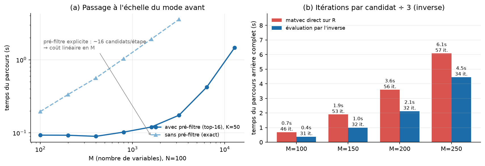
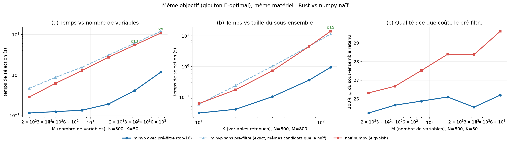
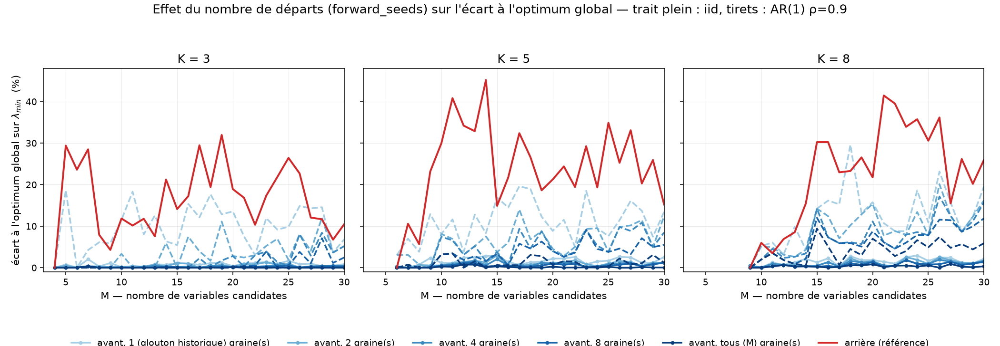
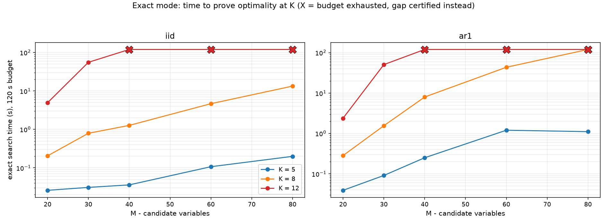
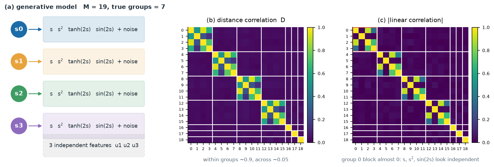
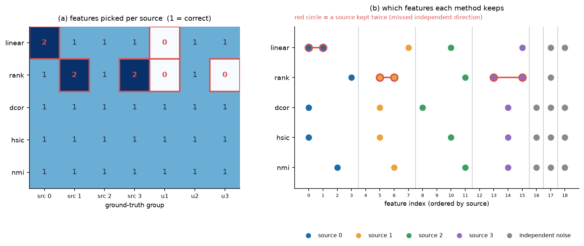

# sifters - spectral feature selection, in Rust

[](https://github.com/alexisrosuel/sifters/actions/workflows/ci.yml)
[](https://github.com/alexisrosuel/sifters#license)

**`sifters` picks the best-conditioned subset of variables** - for each size K, the
K features whose correlation matrix has the largest smallest eigenvalue
`lambda_min(R_S)`.

In practice it **kills multicollinearity**: when `X` has near-collinear columns,
regression and downstream models become unstable and their coefficients hard to
interpret; `sifters` returns the subset that stays as far as possible from
singularity, for every K, with no labels required.

## What is new here, and what is not

The **criterion is not new**. Maximizing `lambda_min` is the **E-optimal**
criterion of optimal design theory (Pukelsheim), the same objective as the sparse
eigenvalue problem (NP-hard, related to densest-`k`-subgraph), and the minimax
cousin of the D-optimal / determinantal-point-process family whose greedy is
pivoted Cholesky. `docs/related-work.md` gives the references, and
`scripts/cssp_baselines.py` implements the classical competitors so the claim can
be checked rather than asserted.

What this package adds is the *way* the criterion is solved:

| | |
|---|---|
| 🎯 **Certified step** | candidates are ranked by a valid upper bound and evaluated in decreasing order, stopping as soon as the best realized value beats the largest remaining bound: the step is then **provably the exact greedy step**. Measured cost at `M=200`: **8 candidates out of `M-K` per step (4.6 %)**, and the walk reproduces an exhaustive `eigvalsh` greedy to `<= 1e-15` |
| 🧬 **One nested family** | `S_1 < S_2 < ... < S_K` for **every** K in a single computation, with a `certified` flag per step - most of the literature answers for one `k` |
| 🏁 **Anytime exact mode** | `select(..., exact=True)` **proves** the optimum at the requested K by branch and bound, or returns a **certified optimality gap** |
| 🔗 **Any dependence matrix** | the engine only needs a PSD unit-diagonal matrix, so distance correlation, HSIC, NMI or a Gaussian copula replace the correlation matrix and *every guarantee survives* |
| ⚡ **Speed** | `10 000` variables -> `100` in `0.6 s` (prefilter); the exact certified greedy is forward-certified rather than exhaustive |
| 🦀 **Safe Rust** | `#![forbid(unsafe_code)]`, multicore (`rayon`), zero heavy dependencies |
| 🐍 **Python** | `import sifters; sifters.select(X, k=50)` |

What is **not** claimed: a new criterion, a global guarantee on the greedy family
(`certified` qualifies a step, never the whole subset), or an approximation ratio
- E-optimality is not submodular, unlike D-optimality, so no `(1 - 1/e)` exists.
The measured gap to the brute-force optimum is reported in section 4, as is the
fact that **no method dominates**: column-pivoted QR, VIF screening and the
Fedorov exchange win on some structures, `sifters` on others.

<p align="center">
  
</p>

Section 4 compares against the weak heuristics above *and* against the classical
competitors (pivoted QR / pivoted Cholesky / D-optimal greedy, strong RRQR with
its global bound, VIF screening, Fedorov exchange, uniform sampling). The gap
widens when the latent structure is rich (factors: **+12 to +136 %** over the
classical baselines); on very regular structures such as AR(1), where an
index-based threshold is already near-optimal, the cheap classical methods win
and the README says so.

<p align="center">
  
</p>

---

## 1. Installation

The core is a Rust library; usage is through the Python extension (PyO3
binding), which is the only public interface.

```bash
pip install .                  # builds the extension via maturin -> import sifters
# or, in development:
maturin develop --release
```

> ⚠️ **`--release` is not optional for anything performance-related.** A plain
> `maturin develop` builds an **unoptimized** extension, measured at **~14x
> slower** than `--release` while producing bit-identical results. It is the most
> natural command to type, so the package reports what it was built with:
> `sifters.build_profile()` returns `"release"` or `"debug"`, and importing
> `sifters` emits a `RuntimeWarning` on a debug build. Reproducible timings in
> `docs/measurements.md`.

`numpy` is not required at runtime: when present it is only used to convert
lists and DataFrames into a contiguous `float64` buffer.

The wheels are built for a generic CPU. For a local speedup, compile for the host
CPU explicitly (do not redistribute such a wheel):

```bash
RUSTFLAGS="-C target-cpu=native" maturin develop --release
```

> The absolute timings in section 4 were measured with `-C target-cpu=native`;
> a generic-CPU release build reproduces them within a factor of about 1.3 to
> 2.5 on the same machine (`docs/measurements.md`).

### Development environment

The project is managed with **pixi** (conda-forge) for the Python environment,
**Cargo** for the Rust crate and **maturin** (PyO3) for the extension. The pixi
tasks mirror the CI gates:

```bash
pixi install            # Python 3.14 + numpy, matplotlib, maturin, pytest, ruff, mypy
pixi run build          # maturin develop --release
pixi run test           # cargo test
pixi run test-py        # pytest tests (run `pixi run build` first)
pixi run lint           # cargo clippy --workspace --all-targets -- -D warnings
pixi run lint-py        # ruff check .
pixi run type-py        # mypy scripts tests
```

The library unit tests (bounds, brute force, inverse, implicit replica, ...)
run standalone with a Rust toolchain:

```bash
cargo test --release
```

## 2. Quick start

```python
import numpy as np, sifters

X = np.random.default_rng(0).normal(size=(500, 300))   # (observations, variables)

r = sifters.select(X, k=30)                 # direction="auto"
print(r.subset, r.lambda_min, r.seconds)

curve = sifters.curve(X, kmin=5)            # {K: lambda_min} for the whole family
family = sifters.path(X, direction="forward", kmax=100)
family.subset_at(42)                      # the subset of size 42

# prefilter (heuristic): only evaluates the top-16 per step, ~4 to 12 % of lambda_min
fast = sifters.select(X, k=30, prefilter=True)

# multi-start: tries 4 starting variables and keeps the best family
# (the gap to the global optimum drops from ~11 % to ~2 % on an AR(1) structure, section 4)
robust = sifters.select(X, k=30, forward_seeds=4)

# exact mode: proves the optimum at k (branch and bound over all k-subsets)
proof = sifters.select(X, k=30, forward_seeds=8, exact=True)
proof.proved_optimal, proof.gap_certified, proof.exact_evals
```

The engine is a native extension: numpy arrays are read through the buffer
protocol, the GIL is released during the computation, and `numpy` remains optional.

The Python benchmarks (scenarios, A/B between revisions) are described in
[`bench/README.md`](bench/README.md).

## 3. What `sifters` returns

A **nested family** `S_M > S_{M-1} > ... > S_1` (mode `backward`) or
`S_1 < S_2 < ... < S_kmax` (mode `forward`), hence a response for *all* sizes K
in a single computation, plus:

* `curve`: `lambda_min` for each K, revalidated by a strict cold Lanczos;
* `order`: the order in which variables are removed/added (allows reconstructing any
  subset);
* per step: upper bound of the retained candidate, number of candidates evaluated, flag
  `certified`, residual, Lanczos iterations.

On the Python side, `select` and `path` return a `sifters.Selection` object:

```python
r.k, r.subset, r.lambda_min       # retained result (original indices, increasing)
r.curve                           # {K: lambda_min} - the whole family
r.subset_at(42), r.lambda_at(42)  # any visited size, without recomputation
r.steps                           # list[Step]: bounds, candidates, certification, residuals
r.certified_steps, r.total_exact_evals, r.total_lanczos_iters
r.seconds, r.path_seconds, r.load_seconds, r.representation, r.eval
r.to_dict()                       # same content, JSON-serializable
```

`progress=callback` is called after each step - returning `False` cleanly interrupts
the traversal (partial result) - `threads=N` sets the size of the Rayon pool,
and `Ctrl-C` is intercepted during the computation.

## 4. Measured results

10-core machine, `-C target-cpu=native`, `f64`. Reproducible with
`scripts/compare_cssp.py` (quality and cost vs the classical competitors),
`scripts/certificate_report.py` (the cost of the certificate),
`scripts/reproduce_speed.py` (the speed ledger), `scripts/make_figures.py`,
`scripts/compare_baseline.py` and `scripts/bench_numpy.py`. Every number below is
also in [`docs/measurements.md`](docs/measurements.md), with its measurement
protocol and - more usefully - with the measurements that turned out to be
unreliable.

### The cost of the certificate (the actual contribution)

Candidates are ranked by a valid upper bound and evaluated in decreasing order,
stopping as soon as the best realized value beats the largest remaining bound.
The step is then **provably the exact greedy step**, and the question is whether
the bound prunes. Forward walk, `N=400`, `K=1..50`, AR(1) `rho=0.9`:

| M | exact evals / candidates | mean exact evals per step | mean candidates per step | 100 % certified |
|---|---|---|---|---|
| 200 | 4.57 % | **8.00** | 175 | yes |
| 400 | 2.13 % | **8.00** | 375 | yes |
| 800 | 1.03 % | **8.00** | 775 | yes |
| 1 600 | 0.51 % | **8.00** | 1 575 | yes |
| 3 200 | 0.25 % | **8.00** | 3 175 | yes |

The mean number of exact evaluations per step is **8.00 - the batch size -
independently of M**, while the candidates a naive greedy would have to evaluate
grow linearly: the relative cost of the certificate decays as `1/M`. On all of
these walks the certified result equals the exhaustive `eigvalsh` greedy to
`<= 1e-15`.

**The backward direction is much weaker, and this is stated rather than hidden.**
The deletion bound depends on the tail of the spectrum:

| `low_rank` p | certified steps | exact evals / candidates | bound excess at winner |
|---|---|---|---|
| 1 | 100 % | 82.9 % | 155 % |
| 4 (default) | 100 % | **40.8 %** | 23 % |
| 8 | 100 % | 33.6 % | 12 % |
| 16 | 100 % | 28.8 % | 8.9 % |
| 32 | 100 % | 26.3 % | 7.4 % |

So the backward cascade saves a factor of about **2.5-3.8** in exact evaluations,
not orders of magnitude; its value is the certified nested family and the cheap
warm starts. The forward direction is where the certificate pays. The prefilter,
incidentally, is not a cheapened certificate: at `M=200` it evaluates 16 or 32
candidates per step against 8 for the certified mode, so it is dominated there -
its advantage appears only at large `M`, where the exact bound (`p = K`) becomes
the dominant cost.

### Quality (exact lambda_min, computed in numpy)

Against the two heuristics the package historically compared to:

| dataset | K | **sifters forward** | min-max corr. greedy | threshold filter |
|---|---|---|---|---|
| blocks (N=500, M=250) | 10 | **0.416** | 0.404 | 0.407 |
| | 30 | **0.317** | 0.266 | 0.277 |
| | 60 | **0.241** | 0.197 | 0.193 |
| AR(1) rho=0.9 | 10 | 0.794 | **0.811** | 0.798 |
| | 30 | 0.306 | 0.279 | **0.324** |
| | 60 | **0.123** | 0.103 | 0.123 |
| factors (rank 20) | 10 | **0.655** | 0.552 | 0.614 |
| | 30 | **0.057** | 0.033 | 0.039 |
| | 60 | **0.036** | 0.021 | 0.021 |

**Honest reading**: the threshold filter is excellent and almost free (1-40 ms); it
remains competitive on a very regular structure (AR(1) at small K). `sifters` wins in the
majority of cases, very widely when the latent structure is rich, and additionally brings
certification and the complete family.

### Quality against the classical competitors

Those two heuristics are the weak ones. A numerical-linear-algebra reviewer
reaches for column-pivoted QR, strong RRQR, VIF screening and the Fedorov
exchange; all four are implemented in `scripts/cssp_baselines.py`. Quality is
reported as the scale-free **efficiency** `eta = lambda_min(R_S) / sigma_K(Z)^2`,
where `sigma_K(Z)^2` is the largest value *any* `K`-subset can reach (Cauchy
interlacing), so `eta <= 1` and is comparable across datasets. `N=400`, `M=200`:

| structure | method | K=5 | K=15 | K=30 |
|---|---|---|---|---|
| iid | `sifters` forward | 0.375 | **0.375** | **0.385** |
| | QRCP = pivoted Cholesky = D-opt | 0.373 | 0.373 | 0.363 |
| | Fedorov exchange | **0.381** | 0.357 | 0.356 |
| | VIF top-k | 0.345 | 0.320 | 0.345 |
| AR(1) rho=0.9 | `sifters` forward | 0.074 | 0.146 | 0.252 |
| | QRCP = pivoted Cholesky = D-opt | 0.072 | **0.161** | **0.258** |
| | Fedorov exchange | **0.075** | **0.166** | 0.155 |
| | threshold filter | n/a | 0.153 | 0.248 |
| blocks | `sifters` forward | 0.044 | **0.431** | **0.407** |
| | QRCP = pivoted Cholesky = D-opt | 0.042 | 0.392 | 0.337 |
| | Fedorov exchange | **0.044** | 0.398 | 0.355 |
| factors (rank 6) | `sifters` forward | 0.036 | **0.557** | 0.540 |
| | QRCP = pivoted Cholesky = D-opt | 0.032 | 0.455 | 0.463 |
| | Fedorov exchange | **0.037** | 0.318 | 0.236 |
| | VIF top-k | 0.027 | 0.518 | **0.560** |

**No method dominates.** That is the honest summary, and each row of it matters:

* `sifters` forward wins where the latent structure is rich - factors `0.557`
  against `0.455` for QRCP (+22 %) and `0.318` for Fedorov (+75 %) at `K=15`;
  blocks `0.407` against `0.337` (+21 %) and `0.355` (+15 %) at `K=30` - and is
  best or within 2 % of best on iid at every K;
* **it loses on very regular structures.** On AR(1), QRCP and Fedorov win. An
  AR(1) chain's well-conditioned subset is essentially an arithmetic progression
  of indices, which an index-based threshold finds directly: the structure does
  the work, not the algorithm;
* `K=5` is decided by a **tie**, not by the criterion - all singletons have
  `lambda_min = 1` - which is why Fedorov and min-max win there by 3-8 %, and why
  `forward_seeds` exists;
* the classical textbook diagnostic, **VIF top-k, is dominated** on three of four
  structures (catastrophically on blocks at `K=5`: `0.005` against `0.042`). This
  is not bad luck: `VIF_j` is `(R^-1)_jj` for the **whole** matrix, and
  `(R_S)^-1` is not the submatrix of `R^-1`, so no VIF says anything about
  `lambda_min(R_S)`. It gives the one-sided bound
  `lambda_min(R) <= 1 / max_j VIF_j`, i.e. a large VIF certifies ill-conditioning
  and a small one certifies nothing;
* **strong RRQR's global guarantee is valid but vacuous.** Its bound
  `sigma_k(Z)^2 / (1 + f^2 k (M-k))` holds (asserted over 240 structure/size/`f`
  combinations) and sits **32x to 2359x** below what plain column-pivoted QR
  already achieves at `M=200`: it guarantees `eta >= 0.001` where the algorithm
  reaches `0.03` to `0.46`. A worst-case statement that does not bite is not a
  substitute for a statement about the cost of exactness.

The consequence for a user is blunt and worth stating: at `M=200`,
**column-pivoted QR is 10x faster than `sifters` and within 10-25 % of its
quality**. Reach for `sifters` when you need the certificate, the whole nested
family for every K, the exact mode, or a non-linear dependence matrix - not for a
raw quality win on an easy structure.

### Speed

The table gives the **default exact mode** (no prefilter), that is, the
**certified** greedy traversal; `N=500` (forward) / `600` (backward), 10-core machine.

| configuration | time | candidates evaluated exactly |
|---|---|---|
| forward, M=400, K=50 | **0.2 s** | 392 |
| forward, M=3 200, K=50 | **0.8 s** | 392 |
| forward, M=1 600, K=150 | **8.4 s** | 1 192 |
| forward, M=10 000 (N=50), K=100, `prefilter=True` | 0.74 s | 1 584 |
| full backward, M=200 | **0.85 s** ⚠️ | 6 235 ⚠️ |
| backward, M=500, kmin=200, `eval="inverse"` | **14.6 s** ⚠️ | 38 392 ⚠️ |
| same, `eval="direct"` **converged** (300 iter.) | **102 s** | 33 976 |

> ⚠️ **The two backward rows above do not reproduce, and the table below cannot
> be reproduced at all.** See [`docs/measurements.md`](docs/measurements.md)
> section 5. Measured with `scripts/reproduce_speed.py`, the four **forward** rows
> hold with margin (0.14x to 0.62x of the claimed time, `exact_evals` matching
> exactly), but the backward rows perform **29 % and 48 % more exact evaluations**
> than stated - a deterministic count, so not a machine effect - and take 1.55x
> and 1.92x longer. The relative gains below compare against a pre-optimization
> revision that is **absent from the git history** (three commits, all from the
> same day, the oldest already being the optimization commit), so
> `bench/compare.py` has no reference revision to check out: nobody can re-run
> them, including me. Treat them as historical.

**Measured gain vs the original version** (historical; the "before" revision is
not in this repository - same inputs, `verify=False`, `max_exact=0`,
`forward_top=0`):

| scenario | before | after | gain (1 core) |
|---|---|---|---|
| forward, M=400, K=50 | 5.11 s | 0.21 s | **x24** |
| forward, M=800, K=50 | 9.98 s | 0.36 s | **x28** |
| forward, M=3 200, K=50 | 36.8 s | 1.22 s | **x30** |
| forward, M=1 600, K=150 | 266 s | 10.3 s | **x26** |
| full backward, M=200 | 8.75 s | 3.16 s | **x2.8** |
| backward, M=500, kmin=200, `inverse` | 193 s | 76.7 s | **x2.5** |
| backward, M=500, kmin=200, `direct` converged | 1835 s | 624 s | **x2.9** |

What explains it:

* **forward selection is certified**: it no longer evaluates the `M-K` candidates, but
  stops as soon as a valid upper bound allows it. Better still, in exact mode it uses the
  **full spectrum** of `R_S`, which makes the secular bound *exact*: the
  evaluations drop to the floor of the batch (8 per step) and we go from 2.4 M to 392
  Lanczos iterations on `fwd3200`;
* **the bordered operator** exploits the materialized correlation (`O(k^2)` instead of
  `O(Nk)` per matvec);
* **the Lanczos solver** is lightened: Ritz vector by inverse iteration (instead of
  an `O(m^3)` diagonalization at each call), second conditional reorthogonalization
  pass, stopping on the Ritz **residual**, Sturm sequence with early exit;
* **the deletion secular seed is finally used** (`deletion_seed` no longer
  restricted it to `R^{k-1}`, the solver silently rejected it): ~30 %
  fewer iterations per candidate;
* the maintained inverse matvec no longer has a per-element branch.

Details and measurement protocol (history, CLI binary) in
[`bench/final_report.md`](bench/final_report.md); the current benchmarks, in
Python, are in [`bench/README.md`](bench/README.md).

### Speed vs a naive 100 % Python / numpy implementation

`scripts/bench_numpy.py` times `sifters` against a **naive E-optimal greedy that
attacks the same problem**, entirely in numpy: at each step, *all* the candidates
remaining are re-evaluated by recomputing `lambda_min` with a complete
`numpy.linalg.eigvalsh` decomposition - that is `K x M` decompositions of size `~ K`. Three
series are compared:

* **sifters without prefilter** (`prefilter=False`, **the default**) - the same
  E-optimal greedy as the naive one, certified but **without evaluating all candidates** at each
  step (sorted by decreasing secular bound); the `lambda_min` obtained remains identical to the
  naive one to within `5x10^-14` where both evaluate the same candidates;
* **sifters with prefilter** (`prefilter=True`, top-16) - only evaluates the 16 best
  candidates of the secular score: this is a heuristic, enabled **explicitly** by
  the caller (never automatically according to size);
* **naive numpy** - the `eigvalsh` reference.

The time gap between series 1 and 2 therefore measures exactly what the prefilter
brings (and what it costs in optimality).

<p align="center">
  
</p>

> ⚠️ **Tables below measured before the optimization of the exact path**: the column
> "sifters exact" there is overestimated by a factor of ~2.5 (see section 4 "Speed" and
> [`bench/final_report.md`](bench/final_report.md)). The prefilter and naive
> numpy columns remain valid; `scripts/bench_numpy.py` can refresh the whole set.

Sweep over the number of variables (`N=500`, `K=50`):

| M | sifters prefilter | sifters exact (default) | naive numpy | naive / prefilter |
|---|---|---|---|---|
| 200 | **0.11 s** | 0.46 s | 0.28 s | x2.5 |
| 400 | **0.12 s** | 0.87 s | 0.62 s | x5.0 |
| 800 | **0.13 s** | 1.54 s | 1.27 s | x9.6 |
| 1 600 | **0.19 s** | 3.05 s | 2.72 s | x14 |
| 3 200 | **0.41 s** | 6.06 s | 5.44 s | x13 |
| 6 400 | **1.18 s** | 12.0 s | 10.9 s | x9.3 |

Sweep over subset size (`N=500`, `M=800`):

| K | sifters prefilter | sifters exact (default) | naive numpy | naive / prefilter |
|---|---|---|---|---|
| 10 | **0.03 s** | 0.06 s | 0.06 s | x2.0 |
| 20 | **0.04 s** | 0.24 s | 0.17 s | x4.3 |
| 40 | **0.10 s** | 1.01 s | 0.72 s | x7.0 |
| 80 | **0.36 s** | 4.57 s | 4.49 s | x13 |
| 120 | **0.94 s** | 11.3 s | 14.0 s | x15 |

What the prefilter costs in quality (panel (c): `lambda_min` prefiltered vs exact):

| `M` (K=50) | 200 | 400 | 800 | 1 600 | 3 200 | 6 400 |
|---|---|---|---|---|---|---|
| loss of `lambda_min` | -4.1 % | -3.8 % | -6.0 % | -8.1 % | -10.0 % | -11.6 % |

| `K` (M=800) | 10 | 20 | 40 | 80 | 120 |
|---|---|---|---|---|---|
| loss of `lambda_min` | -6.1 % | -4.9 % | -8.5 % | -6.6 % | -5.6 % |

**Honest reading** - the naive one is not a scarecrow:

1. **With a strictly equal algorithm, numpy holds its own - before the optimization of the
   exact path.** When `sifters` evaluated *all* the candidates like the naive one, it was
   on equal footing: slower at small `M`/`K`, barely ahead at `K=120` (11.3 s versus 14.0 s).
   `numpy.linalg.eigvalsh` (LAPACK) is very optimized; since then, the exact mode of
   `sifters` **no longer evaluates all the candidates** (certification by secular bound) and
   beats it clearly, but the speedup still does not come from a better spectral
   solver: it comes from the fact that it evaluates *far fewer candidates* (bounds,
   certification in both directions, maintained inverse, and prefilter if enabled).
2. **The prefilter speeds up everywhere, but is paid for in quality.** It divides the time of the
   exact greedy by 2 to 16 depending on the configuration, at the cost of **4 to 12 %** of `lambda_min`
   - worst case measured: -11.6 % at `M = 6 400`. It is **never enabled automatically**:
   it is an explicit choice (`prefilter=True`), including
   at small `M` since the old guard "exact below 512" has disappeared.
   As the switch depends on the problem, it is up to the user to decide.
3. **Bottom line**: the naive `eigvalsh` is an excellent choice for small problems; the
   default mode of `sifters` (exact greedy) is the right trade-off as soon as `M` grows or
   when one wants the whole certified nested family in a single computation. The prefilter is
   there when one prefers speed to a few percent of `lambda_min`.

### Gap to the global optimum (measured by brute force)

The greedy is myopic: "certified" qualifies each **step**, not the subset. To
quantify the gap, `sifters` was compared to the global optimum obtained by enumerating **all**
the `C(M,K)` combinations (`M <= 30`, `N = 400`, average of 3 seeds):

| structure | K | `forward_seeds=1` | `=2` | `=4` | `=8` | all (`=M`) | backward |
|---|---|---|---|---|---|---|---|
| iid | 3 | 0.83 % | 0.55 % | 0.30 % | 0.17 % | **0.01 %** | 2.10 % |
| iid | 8 | 1.64 % | 1.17 % | 0.97 % | 0.72 % | **0.36 %** | 4.11 % |
| AR(1) rho=0.9 | 3 | 10.93 % | 4.23 % | 2.11 % | 1.01 % | **0.02 %** | 16.68 % |
| AR(1) rho=0.9 | 5 | 11.91 % | 7.35 % | 5.84 % | 4.12 % | **1.37 %** | 26.94 % |
| AR(1) rho=0.9 | 8 | 12.86 % | 9.90 % | 7.89 % | 6.73 % | **4.29 %** | 23.84 % |

<p align="center">
  
</p>

Three lessons:

* **the gap does not diverge with M**: it rises from `M ~ 10` to `M ~ 20`, then plateaus. The
  determining parameter is `M - K` (the number of variables "in excess"), not `M`;
* **most of the forward gap comes from the initial seed**, not from the greedy rule:
  all single variables have `lambda_min = 1`, so the first step is not guided by
  the objective. Hence `forward_seeds`, which brings 10.9 % -> 0.02 % at `K = 3` on AR(1);
* **backward elimination remains far behind** in quality (10 to 30 %): its myopia is
  intrinsic, unlike that of the forward start.

### Exact mode: proving the optimum at K

`select(X, k=..., exact=True)` closes the gap: a branch and bound explores the
`k`-subsets and either **proves** the optimum or returns a **certified optimality
gap**.

The bound costs nothing. `lambda_min` is monotonically non-increasing as the set
grows (Cauchy interlacing: `R_S` is a principal submatrix of `R_T` for
`S subset T`, hence `lambda_min(R_S) >= lambda_min(R_T)`). The value of a partial
set therefore upper-bounds every completion of it, and the search only ever
evaluates `f(S + {j})` - exactly the quantity it needs to order the children. The
greedy family then supplies the incumbent, which is what makes the proof cheap.

Time to prove optimality (N=400, incumbent `forward_seeds=8`, 120 s budget,
`bench/exact.py`):

| structure | K | M=20 | M=30 | M=40 | M=60 | M=80 |
|---|---|---|---|---|---|---|
| iid | 5 | 0.03 s | 0.03 s | 0.04 s | 0.11 s | 0.20 s |
| iid | 8 | 0.21 s | 0.79 s | 1.3 s | 4.7 s | 13.4 s |
| iid | 12 | 4.9 s | 55.6 s | *gap 13.7 %* | *12.4 %* | *12.1 %* |
| AR(1) rho=0.9 | 5 | 0.04 s | 0.09 s | 0.25 s | 1.2 s | 1.1 s |
| AR(1) rho=0.9 | 8 | 0.28 s | 1.6 s | 8.0 s | 43.5 s | *gap 0.77 %* |
| AR(1) rho=0.9 | 12 | 2.4 s | 50.6 s | *gap 4.5 %* | *3.0 %* | *2.0 %* |

*Italic* cells hit the 120 s budget: the search returns its best subset together
with the relative gap that still separates it from the optimum, so the answer
stays usable and honest.

<p align="center">
  
</p>

Two practical points:

* the exact search does not only certify, it **improves**: on AR(1) it gains
  between +0 % and +20 % of `lambda_min` over the multi-start greedy (for
  instance +19.7 % at `M = 80, K = 8`, where the proof times out but the
  incumbent is already much better);
* `K` is the cost driver, far more than `M`: on AR(1), `K = 12` at `M = 80` is
  as expensive as `K = 12` at `M = 40`. For `K <= 8` and `M <= 80` the proof
  lands in seconds.

## 5. How it works

> Detailed version, formulas and complete invariants: **[`docs/algorithm.md`](docs/algorithm.md)**.

### 5.1 The right criterion: the secular equation

The eigenvalues of the submatrix with index `i` removed are **exactly** the
roots of (KKT conditions of `min x^T R x` under `x_i = 0`):

```
S_i(mu) = sum_l u_l(i)^2 / (lambda_l - mu) = 0 ,      smallest root in (lambda_1, lambda_2)
exact eigenvector:  x = (R - mu I)^-1 e_i
```

For an **addition**, the bordered matrix `[[R_S, c],[c^T, 1]]` gives
`1 - mu = sum_l (u_l x c)^2/(lambda_l - mu)` and `x = [-(R_S - mu I)^-1 c ; 1]`. These two identities
provide both the **ranking criterion**, the **bounds** and the **warm starts** of
Lanczos - this is what distinguishes `sifters` from a simple correlation filter:
the first-order loss equals `sum_l g_l^2/(lambda_l - lambda_1)`, weighted by the proximity of the
eigen-directions, and not `|g_1|`.

### 5.2 The certified cascade (backward elimination)

```
1. y = R_S u ; rq = u^T y                              (1 matvec)
2. bound_i = min(Rayleigh_i, Temple_i) for each candidate        O(p x k)
   - Rayleigh: rho_i = (rq - 2u_i y_i + u_i^2)/(1-u_i^2)   - valid for any u, O(1)
   - Temple p-dimensional: tail lower-bounded by Cauchy-Schwarz, ~25x tighter
3. sort by DECREASING bound, evaluate exactly until
   best_value >= bound of the next candidate   ->  step CERTIFIED
```

### 5.3 Evaluation by the maintained inverse (`eval="inverse"`)

`lambda_min(R_{-i})` is the **largest** eigenvalue of `R_{-i}^-1`, and the inversion
amplifies the relative gaps at the bottom of the spectrum (cluster `{0.0050, 0.0057,...}` -> `{200, 175,...}`).
We maintain `W = R^-1` **without factorization per candidate**:

```
A^-1 = W_{-i,-i} - (1/W_ii) w w^T ,  w = W_{.,i}     (rank 1, O(k^2))
```

that is ~20 Lanczos iterations instead of 100-150, at **better** accuracy.

### 5.4 Numerical engineering

* reorthogonalized Lanczos, **explicit** orthogonality constraints for deflation
  (the blow-up by projected operator `(I-P)A` is unstable: amplification `alpha/beta`);
* invariant subspace detection (no spurious eigenvalues from amplification
  of noise);
* `representation="implicit"` (`R x = Z_S^T(Z_S x)`, `O(Nk)`) when `N << k`;
* *packed* lower triangle, blocked parallel GEMM construction, vectorizable matvec,
  variable removal in `O(k)` by row/column swap;
* `representation` / `eval` chosen automatically according to `M`, `N`, memory and definiteness.

## 6. Beyond the linear link: selecting on any dependence

Everything above maximizes `lambda_min(R_S)` where `R` is the **linear**
correlation matrix. Two variables linked by `y = x**2` are invisible to it (their
correlation is ~0 whatever the link strength). The engine itself only needs a
symmetric PSD matrix with unit diagonal, i.e. the Gram matrix of normalized
columns, so the whole machinery extends unchanged to any **dependence matrix**
`D` with `D_ij = 0` meaning "columns `i` and `j` are independent".

| method | link it sees | cost |
|---|---|---|
| `linear` | linear (historical) | `O(M^2 N)` |
| `rank` | any **monotone** link (Gaussian copula / normal scores) | `O(M^2 N)` |
| `dcor` | any link, `0` iff independent | `O(M^2 N^2)`, `O(M N^2)` memory |
| `hsic` | any link (RBF kernel), PSD by construction | `O(M^2 N^2)` |
| `nmi` | any link, histogram estimate | `O(M^2 N)` |

Maximizing `lambda_min(D_S)` then means: make the sub-joint as close as possible
to the product of its marginals. Because `trace(D_S) = K` for a unit diagonal,
`lambda_min(D_S) >= 1 - eps` squeezes every eigenvalue into
`[1 - eps, 1 + (K-1) eps]`, hence `det(D_S)` close to 1 and a Gaussian total
correlation `TC(S) = -0.5 log det(D_S) <= -K/2 * log(1 - eps)`.

```python
import sifters
D = sifters.dependence_matrix(X, method="dcor")           # (M, M), unit diagonal
r = sifters.select_from_dependence(D, k=50, exact=True)   # certified E-optimal
# end to end:
r = sifters.select_dependence(X, k=50, method="dcor")
```

`dcor` and `nmi` are not guaranteed PSD: `select_from_dependence` clips the
negative eigenvalues of `D` and rescales the diagonal to 1 before factoring
`D = B^T B` and handing `B` to the existing engine (`center=False`). Since the
engine only ever sees a Gram matrix - the same contract as `Z^T Z` - the
certification, the exact branch and bound and every option of `select` keep
working verbatim.

### Invariance to the scaling of each feature

With the default settings, all five measures are invariant to a per-feature
**positive affine rescaling** `x_j -> a_j x_j + b_j` (`a_j > 0`): the dependence
matrix `D` is unchanged (up to floating point) and so is the selected subset.
The result therefore does not depend on the units or the offset of the features
- `linear` is the usual Pearson correlation, `rank` compares ranks, `dcor` is
invariant to translation and scaling by construction, `hsic` adapts its
bandwidth with the median heuristic, and `nmi` bins uniformly over the observed
range (a scaling moves the bin edges with the data). Two caveats:

* `hsic` with an explicit `sigma` (instead of the default median heuristic)
  **loses** the invariance: the bandwidth must follow the amplitude of the
  feature.
* the two *signed* measures (`linear`, `rank`) change when a feature is
  **reflected** (`x_j -> -x_j`), because the sign of a correlation is
  meaningful. `dcor`, `hsic` and `nmi` measure the magnitude of the dependence
  and are invariant to a reflection.

Note also that the plain engine call `sifters.select(X, center=True)` (the
default) is scale-invariant because it uses the correlation matrix, whereas
`center=False` uses the cosine matrix, which is invariant to a scaling of each
column but **not** to a shift.

### A ground-truth experiment: recovering the independent features

`scripts/independence_recovery.py` checks the claim on a problem whose answer is
known by construction. `M = 19` features are generated from **4 independent
latent sources**: each source produces 4 features through a different link -
`s`, `s**2`, `tanh(2s)`, `sin(2s)` - plus noise, and 3 further features are pure
independent noise. The number of truly independent directions is therefore
**7**, and the ideal answer for `k = 7` is **exactly one feature per source**.

<p align="center">
  
</p>

Panel (a) is the generative model. Panel (b) is the distance-correlation matrix
of the data: it is block diagonal, ~0.9 inside a source and ~0.05 between
sources, so the dependence structure is exactly the one the selector is asked to
find. Panel (c) is the absolute linear correlation: the block of source 0 is
almost entirely dark, because `s` and `s**2` are uncorrelated and so is
`sin(2s)`. A correlation-based criterion sees those features as independent and
has no reason to keep only one of them - this is the trap.

<p align="center">
  
</p>

Asking each method for `k = 7` and scoring the returned subset on the **true**
(distance-correlation) matrix:

| method | `lambda_min(D_dcor)` of the subset | one feature per source |
|---|---|---|
| `linear` | 0.475 | no - source 0 kept twice, one independent feature missed |
| `rank` | 0.733 | no - sources 1 and 3 kept twice |
| `dcor` | **0.953** | **yes** |
| `hsic` | 0.952 | **yes** |
| `nmi` | 0.947 | **yes** |

Panel (a) counts the features kept per source (1 is correct; a red box flags a
violation) and panel (b) shows which features were kept. The nonlinear measures
return one feature per source - they recover the independent directions - while
`linear` and `rank` spend two of their seven slots on a single source. The
subsets are still "optimal" for their own criterion, which is precisely why the
wrong dependence measure cannot be detected by looking at its own `lambda_min`:
scored against the truth, the linear subset loses half of its conditioning
(0.475 vs 0.953).

`tests/test_independence_recovery.py` asserts the experiment: one feature per
group for `dcor`, `hsic`, `nmi` and for the D-optimal criterion, stable over
seeds, and - conversely - that `rank` does recover as soon as the links are
monotone. The two figures are regenerated with

```bash
python3 scripts/make_recovery_figures.py     # requires matplotlib
```


### The D-optimal criterion: minimize the total correlation directly

E-optimality *implies* a small total correlation but does not optimize it (it
controls the worst direction). When the target is literally "the sub-joint
closest to the product of the marginals", the Gaussian multi-information
`TC(S) = -0.5 log det(D_S)` is the right objective:

```python
d = sifters.dopt.select(D, k=50, exact=True)   # max log det(D_S), branch and bound
d.subset, d.det, d.proved_optimal, d.total_correlation
```

`sifters.dopt` is a pure-Python reference solver: a forward greedy with a rank-1
inverse update, and an exact branch and bound that is valid because `det(D_S)`
is non-increasing as the set grows (the Schur complement is `<= 1`), so any
partial set upper-bounds all its completions. The certified Rust engine remains
the E-optimal one.

### Pairwise is not joint

All the measures above are **pairwise**. `D = I` means "all pairs are
independent", which is equivalent to the joint being the product of the
marginals for a pairwise Markov random field or a Gaussian copula, but not for a
general distribution with genuine higher-order (three-way and beyond)
interactions. Detecting those requires an estimate of the joint entropy
`H(X_S)`, which breaks the interlacing/monotonicity structure that the
certification relies on. `lambda_min(D_S)` and `log det(D_S)` remain tractable,
certificate-friendly surrogates.

## 7. Structure

**[`docs/algorithm.md`](docs/algorithm.md)** describes the algorithm in detail (formulas, bounds,
certification, complexities, parameters).

```
src/
  matrix.rs   N x M data (column-major), centering/scaling, degenerate columns
  gen.rs      synthetic generators (iid, equi, AR(1), blocks, factors) + RNG
              - compiled only for unit tests and examples/prof.rs
  packed.rs   packed lower triangle: parallel construction, matvec, swaps
  op.rs       SymOp, packed/implicit representations, submatrices, GEMV Z x w / Z^T x w
  inverse.rs  maintained inverse (initial Cholesky + rank-1 update), operator -A^-1
  lanczos.rs  reorthogonalized Lanczos + constraints, bisection/Sturm
  jacobi.rs   dense cyclic Jacobi (eigenvectors of the tridiagonal)
  dense.rs    dense symmetric eigendecomposition (whole-spectrum fast path)
  exact.rs    exact branch and bound over subsets of a fixed size
  greedy.rs   certified cascade, secular greedy, local swaps, bounds, KKT
  lib.rs      public surface of the crate
crates/
  sifters-python/         native PyO3 extension -> module sifters._sifters
python/
  sifters/__init__.py     Python API: select / path / curve, input conversion
  sifters/dependence.py   dependence matrices: rank/copula, dcor, HSIC, NMI
  sifters/dopt.py         D-optimal solver (max log det, greedy + exact B&B)
  sifters/__init__.pyi    typing stubs (+ _sifters.pyi, py.typed)
scripts/
  make_figures.py       generates the quality / performance README figures
  bench_numpy.py        timing vs naive numpy greedy (docs/img/fig_temps_vs_numpy.png)
  compare_baseline.py   quality/time comparison vs naive baselines (+ shared make_data)
  cssp_baselines.py     the classical competitors: QRCP, pivoted Cholesky (= D-optimal
                        greedy), strong RRQR + its certified floor, VIF top-k, Fedorov
                        exchange, exhaustive eig-oracles, uniform sampling
  compare_cssp.py       quality/cost vs those competitors, on the scale-free
                        efficiency eta = lambda_min / sigma_K(Z)^2
  certificate_report.py the cost of the certificate: exact evals / candidates,
                        backward p-sweep, forward M-scaling
  reproduce_speed.py    re-measures the README speed rows and records the claims
                        that do NOT reproduce (docs/measurements/speed_ledger.json)
  independence_recovery.py  ground-truth demo (recover the independent features)
  make_recovery_figures.py  generates docs/img/fig_recovery_*.png (needs matplotlib)
tests/
  test_sifters.py         binding tests (numpy as oracle)
  test_cssp_baselines.py  invariants of the competitors + the certification claim
  test_dependence.py    tests of the nonlinear dependence extension
  test_independence_recovery.py  ground-truth recovery tests
bench/        Python benchmark harnesses (see bench/README.md)
docs/
  algorithm.md          the algorithm in detail (formulas, bounds, invariants)
  measurements.md       every measurement, its protocol, and what is unreliable
  related-work.md       prior art, positioning, what is and is not claimed
  measurements/         raw JSON of the runs quoted in measurements.md
  python_api.md         full Python API reference
  img/                  README figures + raw measurements
examples/
  prof.rs               Rust profiling driver (keeps Python out of the profile)
pyproject.toml          maturin build backend (pip install . / maturin develop)
pixi.toml               dev environment + tasks
```

## 8. Documentation

- [`docs/algorithm.md`](docs/algorithm.md) - the algorithm in detail (formulas,
  bounds, certification, invariants, parameters);
- [`docs/related-work.md`](docs/related-work.md) - prior art and positioning: what
  belongs to E-optimal design theory, sparse eigenvalue problems, DPPs, RRQR and
  CSSP, and what this package actually claims;
- [`docs/measurements.md`](docs/measurements.md) - every measurement, its protocol,
  the reference machine, and the measurements that turned out to be unreliable;
- [`docs/python_api.md`](docs/python_api.md) - full Python API reference;
- [`bench/README.md`](bench/README.md) - benchmark harnesses and scenarios;
- [`bench/final_report.md`](bench/final_report.md) - historical exact-path
  measurements (CLI era);
- [`CHANGELOG.md`](CHANGELOG.md) - release history and known caveats.

## 9. Known limitations

* **`--release` is mandatory for any timing.** A plain `maturin develop` builds an
  unoptimized extension measured at ~14x slower with bit-identical results. The
  package now reports it (`sifters.build_profile()`), and importing `sifters`
  warns on a debug build - but the trap is easy to fall into
  (`docs/measurements.md` trap 1).
* **The backward half of the speed table does not reproduce.**
  `scripts/reproduce_speed.py` shows the package performing 29 % and 48 % more
  exact evaluations than the README's backward rows claim - a deterministic count,
  so it is a configuration or revision difference, not a machine effect. The
  forward rows do reproduce (0.14x-0.62x of the claimed time). The `x24`-`x30`
  relative gains compare against a revision absent from the git history and cannot
  be re-run by anyone (`docs/measurements.md` section 5).
* **No method dominates, and `sifters` loses on regular structures.** On AR(1),
  column-pivoted QR and the Fedorov exchange beat it; at `M=200` QRCP is ~10x
  faster and within 10-25 % of its quality. The wins are on rich latent structure
  (factors, blocks) and on what the cheap methods cannot provide: the certificate,
  the nested family for every K, the exact mode, the non-linear dependence
  matrices (section 4).
* **The backward certificate prunes weakly.** At the default `low_rank=4` it still
  evaluates 40.8 % of the candidates (26.3 % at `p=32`), so the cascade saves only
  a factor of ~2.5-3.8. The forward certificate is the one that pays: 8 evaluations
  per step, independent of `M` (`docs/algorithm.md` section 12 anticipated this
  from the bound's `1/p` decay).
* **Global guarantees are not what `certified` means.** It qualifies a *step*,
  never the whole subset. E-optimality is neither monotone nor submodular in the
  subset - unlike D-optimality, which has a `(1 - 1/e)` bound - so no
  approximation ratio is claimed and the measured gap to the brute-force optimum is
  a structure-dependent 1-13 % forward and 10-30 % backward.
* **Strong RRQR's global guarantee is valid but vacuous here**: `32x` to `2359x`
  below what column-pivoted QR already achieves at `M=200`. Citing it as a
  competitor's advantage would be citing a bound that does not bite
  (`docs/measurements.md` section 3).
* **VIF top-k has no subset guarantee.** `VIF_j = (R^-1)_jj` describes the whole
  matrix; it yields only `lambda_min(R) <= 1 / max_j VIF_j`, so a small VIF
  certifies nothing about `lambda_min(R_S)`.
* **Singular case (`M > N`)**: no inverse -> direct evaluations at 60-200 iterations.
  A suitable preconditioner remains to be found.
* **Myopic greedy**: the nested family is not globally optimal;
  `swap_passes=n` corrects locally by 1-for-1 swaps, and
  `forward_seeds=n` (mode `forward`) tries several starting variables and keeps the
  best family - the residual gap to the global optimum then goes from ~11 % to ~0.02 %
  on an AR(1) structure at `K = 3` (section 4).
* **Certification**: it uses valid upper bounds, but whose margin
  depends on the accuracy of the `p` eigenpairs; with `eval="direct"` and
  `iters_warm=60` the evaluations are not converged (use `eval="inverse"`,
  or increase `iters_warm`).
* **Python binding**: native PyO3 extension (`crates/sifters-python`), GIL released during
  the computation; installation requires a Rust build chain (`maturin`, see section 1).
* **Forward prefilter**: explicit heuristic, disabled by default. It is not a
  cheapened certificate - at `M=200` it evaluates *more* candidates (16 or 32)
  than the certified mode (8) and gives up the guarantee. Its advantage appears
  only at large `M`, where the exact bound becomes the dominant cost, and it can
  shave `lambda_min` by 4 to 12 % (section 4).
* **Exact mode**: it targets a single `K` and breaks the "whole family in one
  pass" promise, so the nested `curve`/`steps` still come from the greedy walk
  that seeded it. The worst case is exponential and the cost is driven by `K`:
  past the budget the search returns a certified gap instead of a proof
  (section 4).
* **Dependence measures** (section 6): `dcor` and `hsic` cost `O(M^2 N^2)` and
  materialize `M` matrices of size `N^2`; they are meant for moderate `N` /
  `M`. All measures are **pairwise**, so higher-order interactions are not
  captured. The D-optimal solver is a Python reference (not the certified Rust
  engine) and its branch and bound is exponential in the worst case.

## 10. License

Dual licensed under either of

* Apache License, Version 2.0 ([`LICENSE-APACHE`](LICENSE-APACHE))
* MIT license ([`LICENSE-MIT`](LICENSE-MIT))

at your option.

Unless you explicitly state otherwise, any contribution intentionally submitted
for inclusion in this project by you, as defined in the Apache-2.0 license, shall
be dual licensed as above, without any additional terms or conditions.
